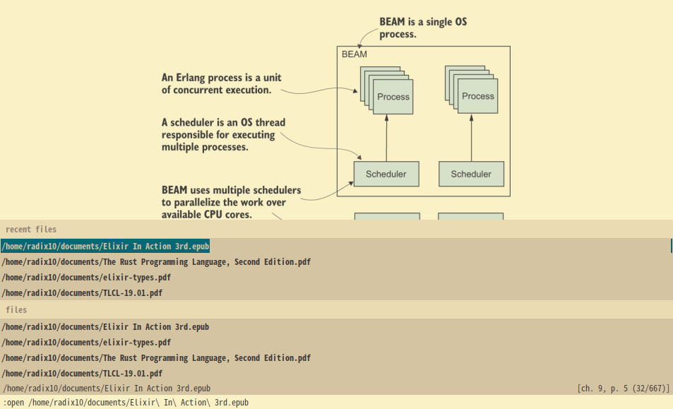
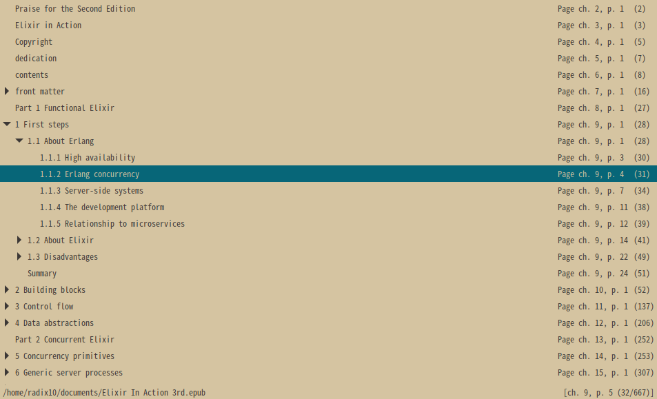
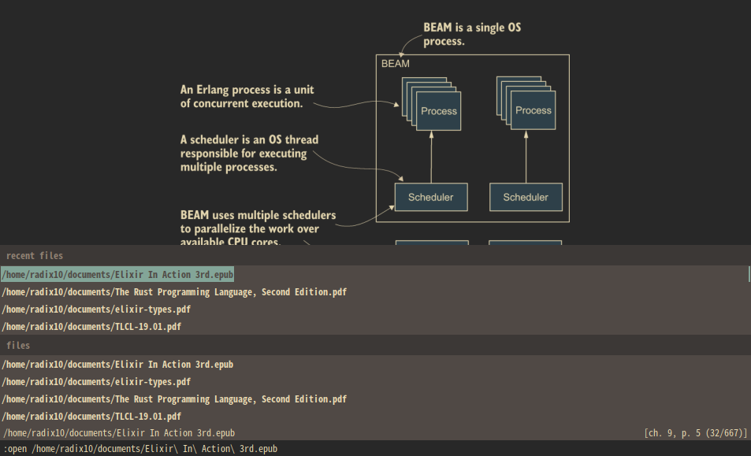
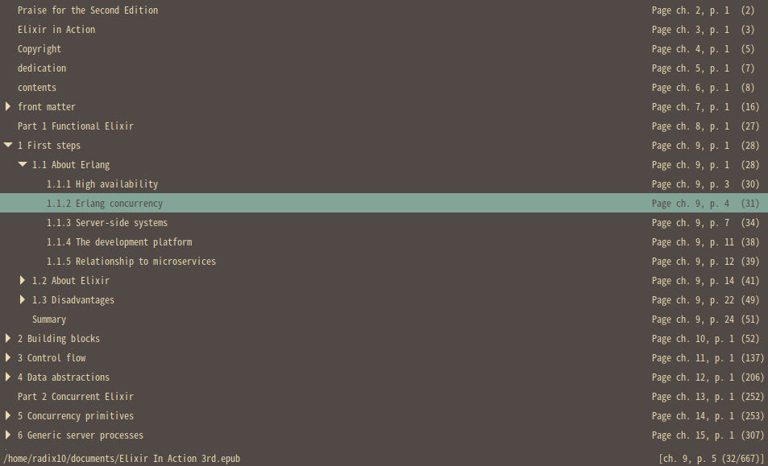

The gruvbox color theme for Zathura
=============================

Visit the [gruvbox] homepage
------------------------------

zathura-gruvbox is heavily inspired by [zathura-solarized][], [gruvbox][] and [zathura][].

See the [gruvbox] homepage for screenshots, palette and documentation.

Installation
------------
The dark or the light themes are available. To install the dark version please do the following:

        $ cd zathura-gruvbox
        $ cp zathura-gruvbox-dark ~/.config/zathura/zathurarc

To install the light version go with:

        $ cd zathura-gruvbox
        $ cp zathura-gruvbox-light ~/.config/zathura/zathurarc

Screenshots
-----------

[zathura-solarized]: https://github.com/lennonwoo/zathura-solarized
[gruvbox]: https://github.com/morhetz/gruvbox
[zathura]: https://github.com/pwmt/zathura
